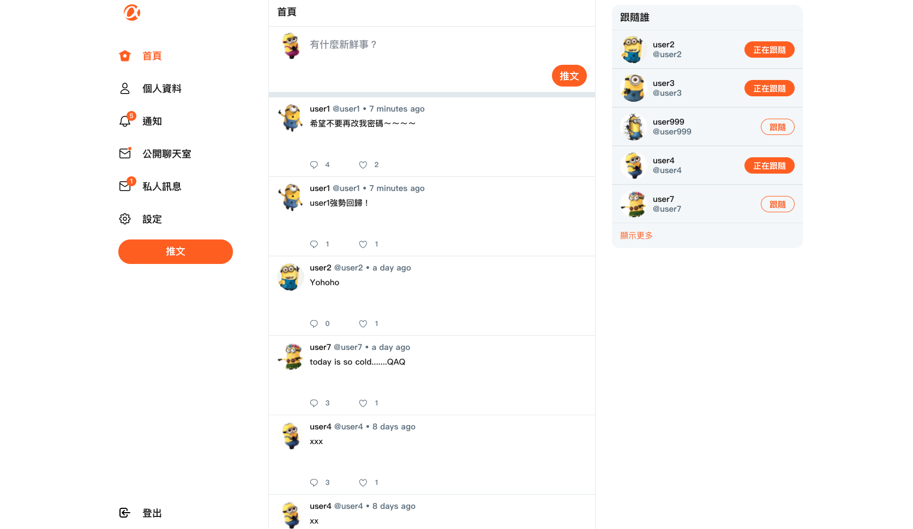
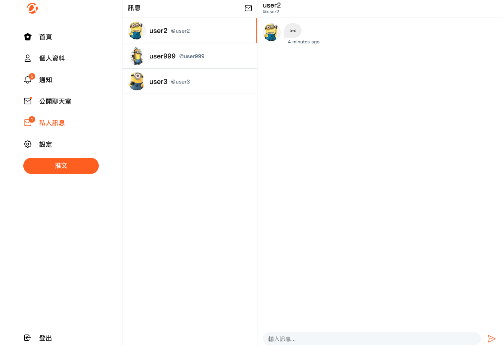
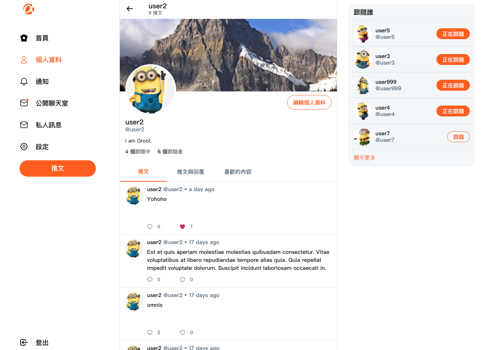

# twitter-api-2020-frontend 

Simple social platform inspire by Twitter (To be honestly, definitely inspired by [ALPHA Camp](https://tw.alphacamp.co/))

<p align="left">
  &#8594; <a  href="https://r05323045.github.io/twitter-api-2020-frontend/">Explore The Website</a>
</p>

<br/><br/>

<p align="center">
  
</p>
<br/><br/>

---

## User Interface

**Chatroom**
<br/><br/>
<p align="center">
  
</p>

**Profile**
<br/><br/>
<p align="center">
  
</p>

**Admin Dashboard**
<br/><br/>
<p align="center">
  
</p>

---

## Features

**Visitor**

As a visitor, you can:

1. Sign up for an account and join this platform
2. Explore tweets on this platform, including the content tweeted by yourself
2. Interact with users by Follow, Like, Reply and Chat 
3. Customize your profile by an avatar, cover, and self-introduction
4. Chat with users at an online chatroom
5. Here is a user account you can use

|  account   | password  |
|  ----  | ----  |
| @user1  | 12345678 |

**Admin**

As an admin, you can:

1. Manage all tweets on this platform, deleting the tweet is available for the admin
2. Dashboard for observing all users, easy to find out who is an active user
3. Here is an admin account you can use

|  email   | password  |
|  ----  | ----  |
| root@example.com  | 12345678 |

**Upcoming Features**

1. Personal message, gossiping is necessary
2. Notification, things related you will be caught easily

---

## Third-party APIs and Open source used in this project

**Front-end**

- Using [Vue-cli](https://cli.vuejs.org/) for Vue.js project  management
- Using [Vuex](https://github.com/vuejs/vuex) for storing the user's state
- Using [vue-loading-overlay](https://github.com/ankurk91/vue-loading-overlay) to customize personal loading animation
- Using [Socket io](https://github.com/socketio/socket.io) for for send message to back-end

- Using [moment.js](https://github.com/moment/moment/) for parsing time and display the date range from now
- Using [Sweetalert2](https://github.com/sweetalert2/sweetalert2) to give tips to the user when they meet some problems

**Back-end**

- Using [JSON Web Tokens](https://jwt.io/) to build token based authentication
- Using [imgur-node-api](https://github.com/jamiees2/imgur-node-api) for uploading images
- Using [bcryptjs](https://github.com/dcodeIO/bcrypt.js) to encrypt the password
- Using [dotenv](https://github.com/motdotla/dotenv) to deal with the environment variables
- Using [Socket io](https://github.com/socketio/socket.io) for catching message from front-end

---

## Back-end Repository

[twitter-api-2020](https://github.com/iamy8000/twitter-api-2020)

---
### Setup Project at local

Note that the below setup steps are for **Front-end**


#### Clone to loacl side
```bash
$ git clone https://github.com/r05323045/twitter-api-2020-frontend.git
```
#### Start
```bash
$ cd twitter-api-2020-frontend
```
#### Install the packges
```bach
$ npm install
```
#### Compiles and hot-reloads for development
```bach
$ npm run serve
```
#### Compiles and minifies for production
```bach
$ npm run build
```
---

